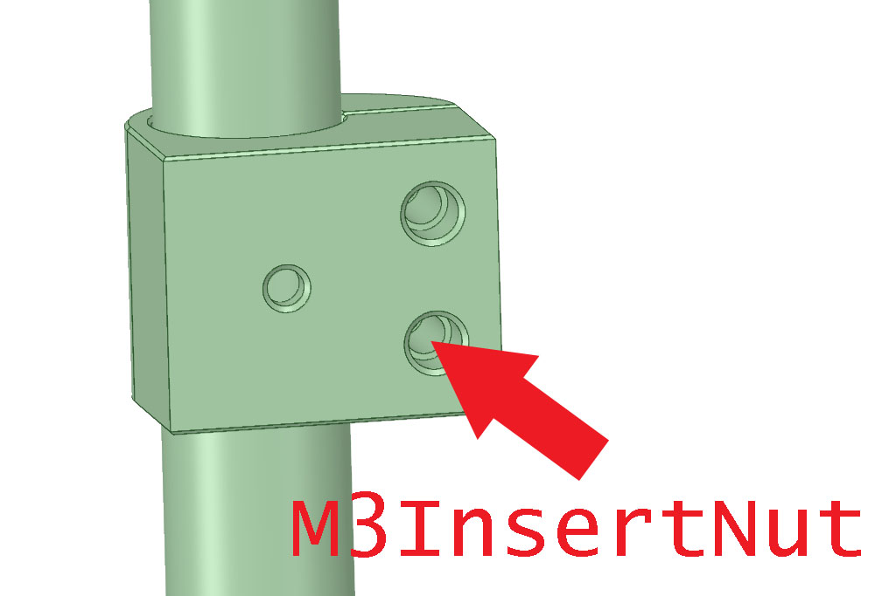

# WeightPlus for VESA Monitor Arms

## Feature

- Add 1kg of weight to the monitor arm.
- Increasing the weight is helpful when using monitors that are lighter than the minimum weight of the gas spring type
  arm.
  
## Parts Printing

- Layer height 0.2mm, Extrusion width 0.4mm, Wall count 4, Top/Bottom layers 8, Infill 40%.
- You can choose from two types according to the mounting method of the VESA mount.   
  One is a simple type with an M4 bolt hole. You can insert a bolt or place a nut.   
     
  The other type has ahexagonal guide for the nut.   
  
- Similarly, you can choose from two types depending on the nut that fixes the weight.  
  One is a type with a hole for inserting a heat nut.   
     
  The other type has a hexagonal hole for the nut.   
  
- From the above combination of 4 STL files, select the one you prefer and print 4 pieces.

## BOM

- M4 x 10~12mm SHCS x4 (Depends on the screw holes of the monitor)
- M4 Spacer x4
- M3 x 12mm SHCS x8 (for M3Hex type)
- M3 Nut x8 (for M3Hex type)
- M3 x 20mm SHCS x8 (for M3InsertNut type)
- M3 Insert Nut x8 (for M3InsertNut type)
- M3 Spacer x8
- 20mm(OD) x 200mm(L) Stainless steel or brass weight x2

## Assemble

   

